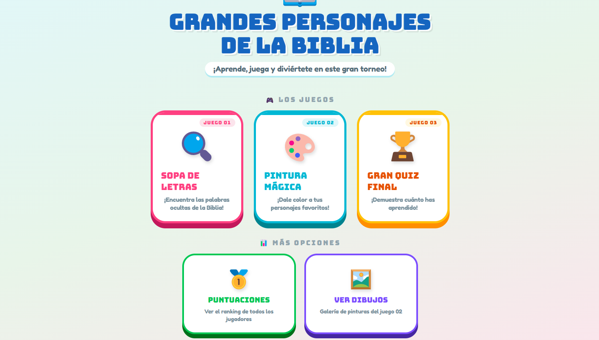
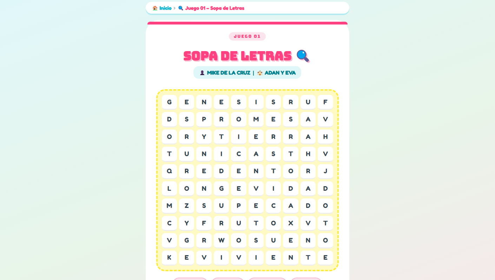
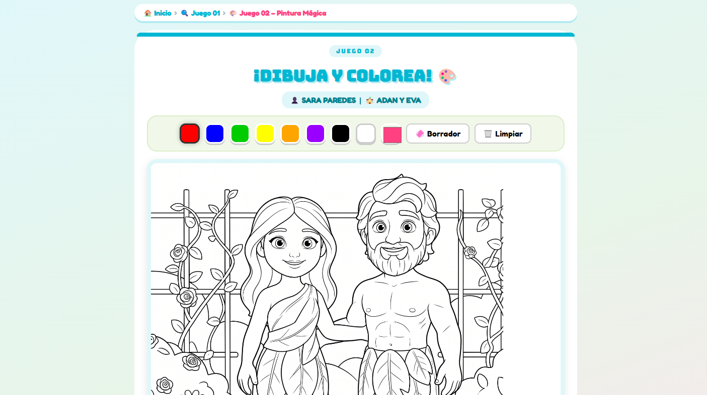
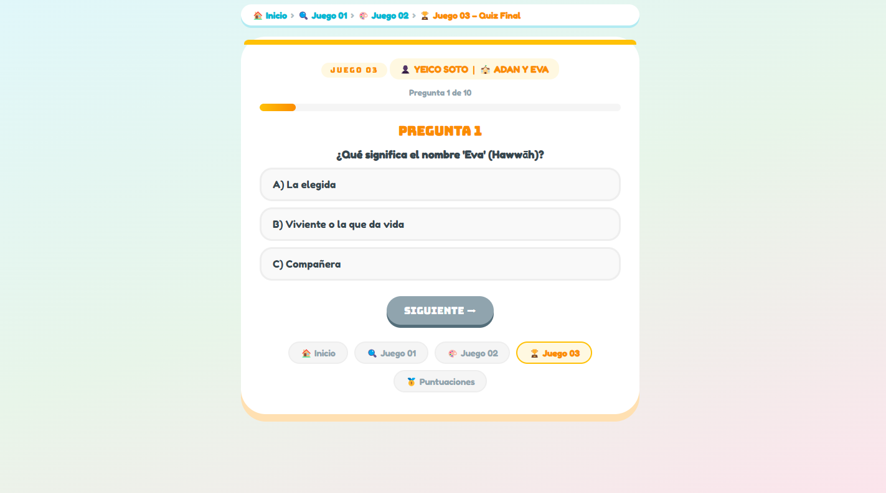

# 🎨 Aula Dinámica - Juegos Bíblicos Interactivos

Sistema web educativo desarrollado en **PHP** para apoyar la enseñanza bíblica a niños, especialmente en contextos de **escuela dominical y clases virtuales**.

Este proyecto nace con un propósito claro: **reforzar el aprendizaje de la Palabra de Dios de forma divertida, visual e interactiva**.

---

## ✨ ¿Cómo se usa en la iglesia?

1. 📖 Se imparte la clase bíblica (presencial o virtual).
2. 🎮 Luego los niños ingresan al sistema.
3. 🧠 Refuerzan lo aprendido mediante juegos:
   - Sopa de letras
   - Pintura interactiva
   - Trivia bíblica
4. 🏆 Se motivan con puntuaciones y participación.

---

## 📸 Capturas del sistema

| Inicio | Juego 01 |
|:--:|:--:|
|  |  |

| Juego 02 | Juego 03 |
|:--:|:--:|
|  |  |

| Puntuaciones |
|:--:|
|  |

---

## 🚀 Juegos incluidos

### 🔍 Juego 01 – Sopa de Letras
Refuerza palabras clave del tema bíblico.

### 🎨 Juego 02 – Pintura Mágica
Los niños colorean una imagen y el dibujo se guarda automáticamente.

### 🏆 Juego 03 – Trivia Bíblica
Preguntas con opciones múltiples para evaluar comprensión.

### 🥇 Puntuaciones
Ranking de participación con sistema de puntos.

---

## 🛠️ Tecnologías

- PHP (sin base de datos)
- HTML5 Canvas
- Bootstrap 5
- JSON (almacenamiento)
- JavaScript

---

## ⚙️ Instalación

1. Clona el repositorio:
git clone https://github.com/psdann/aula-dinamica-juegos-php.git

2. Sube el proyecto a un servidor con PHP.

3. Asegúrate de:
- Permitir escritura para crear:
  - `puntuaciones.json`
  - carpeta `dibujos/`

4. Edita:
master_array.php

para personalizar:
- nombres
- temas
- preguntas
- imágenes

---

## ❤️ Propósito

Este proyecto fue creado con el deseo de **servir al ministerio infantil** y apoyar a maestros en la enseñanza de la Palabra de Dios.

> “Instruye al niño en su camino, y aun cuando fuere viejo no se apartará de él.”  
> — Proverbios 22:6

---

## 📬 Contacto

👤 Daniel Quinde  
📧 danielquinde@gmail.com  

Si este proyecto te ayuda, puedes escribirme.  
¡La idea es compartir y bendecir, no lucrar! 🙌

---

## 📄 Licencia

MIT — Puedes usarlo, modificarlo y adaptarlo libremente.
